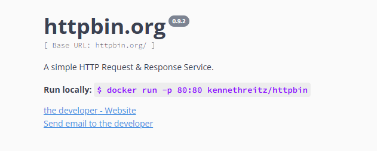

# Request Demo
- 掌握 `headers` 参数的使用
- 掌握 发送带参数的请求
- 掌握 `headers` 中携带 cookie
- 掌握 `cookies` 参数的使用
- 掌握 `cookieJar` 的转换方法掌握 超时参数 `timeout` 的使用掌握 代理 ip 参数 `proxies` 的使用掌握 使用 `verify` 参数忽略CA证书
- 掌握 `requests` 模块发送 post 请求
- 掌握 利用 `requests.session` 进行状态保持

## 大部分测试
测试 API 由 httpbin.org 提供

[示例代码](./request_demo.py)

## 关于 cookies 的测试
[示例代码](./cookies_demo.py)

## 关于 session 的测试
[示例代码](./session_demo.py)